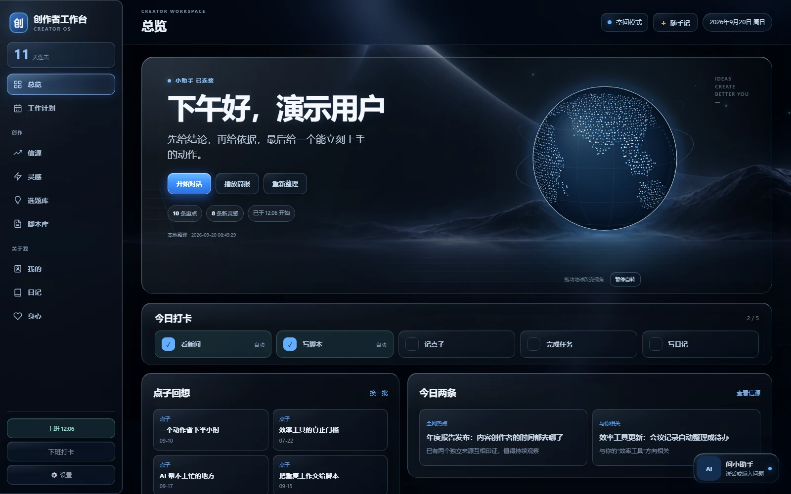
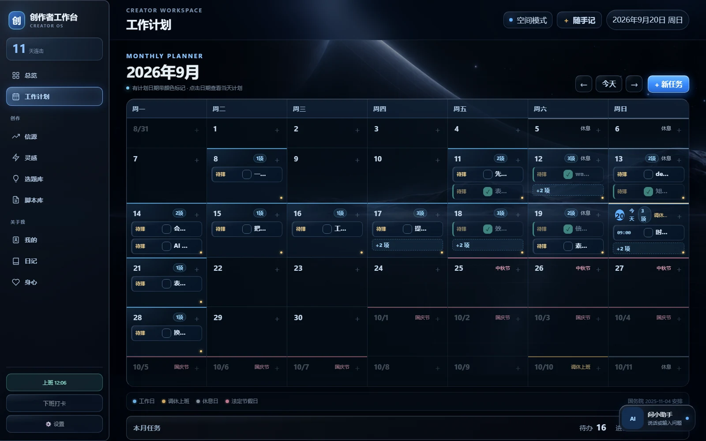
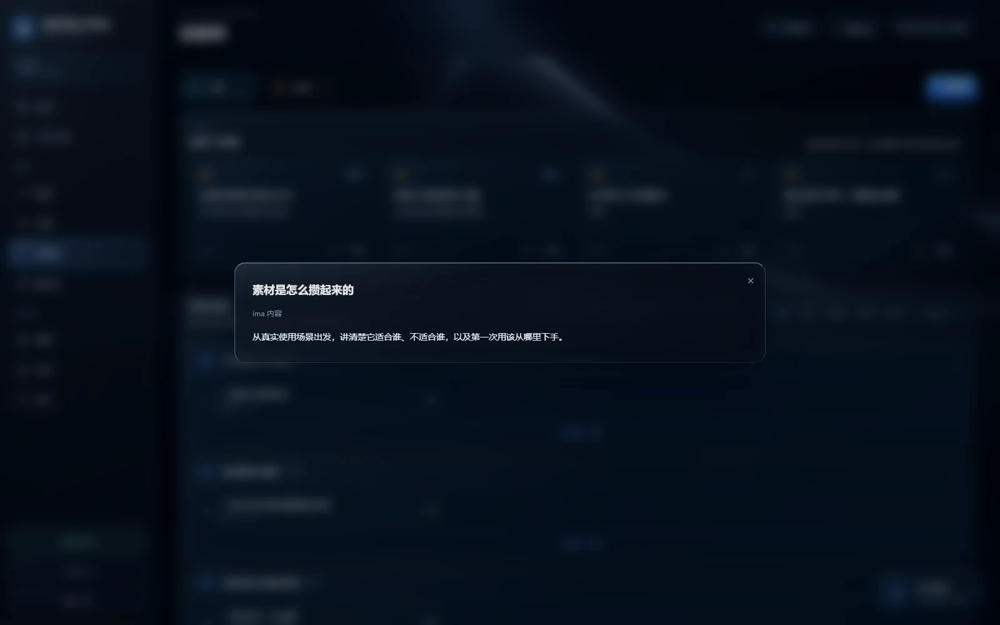
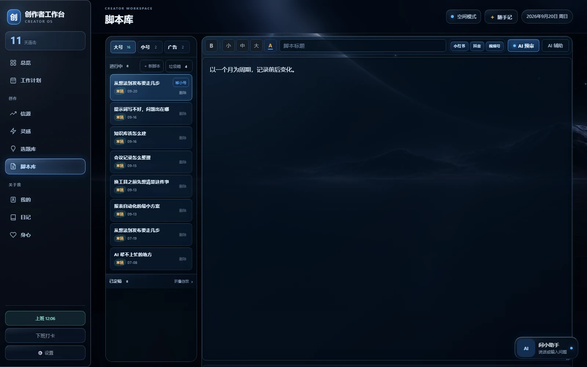

# 创作者工作台

一个运行在本机的个人创作工作台，用来集中管理热点、灵感、选题、脚本、周计划、日记和账号数据。它提供可选的 AI、Obsidian、ima 与抖音收藏联动；个人数据默认只保存在使用者自己的电脑上。



> 截图中的内容均为演示数据，不包含任何真实用户信息。

## 主要功能

- 热点聚合与个性化简报
- 灵感、选题和脚本工作流
- 周计划、打卡、日记与本地资料库
- 可自定义名称的本地创作助手
- 可选的 OpenAI 兼容接口、Obsidian、ima 和抖音收藏联动

### 界面预览

 

发布前的合规审查，内置抖音、小红书、视频号、B 站四个平台的规则包，**不填 AI Key 也能用**：



## 快速开始（Windows）

1. 安装 [Python 3.11 或更高版本](https://www.python.org/downloads/windows/)，安装时勾选 `Add Python to PATH`。
2. 下载或克隆本仓库。
3. 双击 `首次安装.bat`，等待依赖与 Chromium 安装完成。
4. 双击 `打开工作台.vbs`，浏览器会自动打开本地页面。
5. 进入左下角“设置”，填写自己的工作台名称、助手名称和个人资料；需要时再开启外部服务。

命令行启动方式：

```powershell
py -3 -m venv runtime
runtime\Scripts\python.exe -m pip install -r requirements.txt
runtime\Scripts\python.exe -m playwright install chromium
runtime\Scripts\python.exe workbench.py
```

默认只监听 `127.0.0.1`，并在 `5210` 到 `5220` 之间选择可用端口。

macOS 或 Linux 只能用上面的命令行方式启动：`首次安装.bat` 和 `打开工作台.vbs` 是 Windows 专用脚本，其他系统请手动建虚拟环境。另外 API Key 的系统级加密存储只在 Windows 上生效。

## 哪些功能开箱就能用

下载后不需要任何账号或密钥，直接可用的：

- 选题库、脚本库、灵感收集
- 周计划、打卡、日记、身心记录
- 我的资料库、多账号信息管理
- 本地数据快照与备份

需要自己准备才能用的：

| 功能 | 需要准备什么 | 没配置会怎样 |
|---|---|---|
| AI 小助手、脚本审稿 | 一个 OpenAI 兼容接口的 API Key（如 DeepSeek） | 助手区提示未配置，其他功能照常 |
| 知识库联动与检索 | 一个本地 Markdown 文件夹（[首次启动自动搭好](#本地知识库联动)，装 Obsidian 插件可让素材自动流入） | 搜不到内容，写入不可用 |
| 热点聚合 | 能联网即可，部分媒体源可能临时失效 | 拿不到最新条目 |
| 抖音收藏同步 | 依赖装好 + Chromium + 扫码登录抖音 | 该模块不可用，不影响其他功能 |
| ima 知识库联动 | 在腾讯 ima 侧申请应用并拿到 client_id | 该联动不可用 |

**所有外部服务都可以不开。** 全部关掉之后，它就是一个纯本地的创作管理工具，数据只存在你自己的电脑上。

## 第一次打开是空的

工作台不预置任何示例数据。首次启动你会看到空的选题库、空的脚本库——这是正常的，内容需要自己录入或从外部导入。

## 本地知识库联动

工作台跟一个本地 Markdown 知识库双向打通：**素材自动流进来，AI 读素材写维基，工作台的选题和脚本镜像出去。**

**这个知识库在工作台第一次启动时就自动搭好了**（建在 `用户数据/知识库/`），你不用手动建目录。

### 要装 Obsidian 吗？要

工作台本身只读写 Markdown 文件，不依赖 Obsidian 软件。但**想让素材自己流进来，就要靠 Obsidian 的插件** —— 这是整条链路里最能省事的一环：

| 插件 | 作用 | 素材落到哪 |
|---|---|---|
| **Douyin Favorites Sync** | 抖音收藏同步成笔记（标题、标签、逐字稿、视频附件） | `原始素材/灵感/抖音收藏夹/` |
| **Weread** | 微信读书的划线、想法自动同步 | `原始素材/微信读书/` |
| **Clipper** | 浏览器里一键把网页剪藏成 Markdown | 你选的位置 |

装法：从 [Obsidian 官网](https://obsidian.md)下载安装（免费）→ 打开知识库文件夹 → 设置 → 第三方插件 → 关掉安全模式 → 浏览 → 搜上面三个名字安装。

> 抖音那个插件依赖额外的抓取端配合，光装插件没有数据来源；细节看插件自己的说明。

### 三层结构

用的是 Karpathy 的 LLM Wiki 模式：**不是每次提问去原文重新检索，而是边收边编译** —— 每进一份素材，AI 读它、提炼它、织进已有的维基页。

| 层 | 目录 | 谁写 | 谁读 | 能不能改 |
|---|---|---|---|---|
| **原始素材层** | `原始素材/` | 你 + 抓取插件 + 工作台 | AI | **AI 永不修改、删除、移动** |
| **维基层** | `维基/` | AI | 你 | AI 全权增删改 |
| **规范层** | `规范/` + `AGENTS.md` | 你和 AI 共同演进 | AI | 改了要记日志 |

### 自动搭好的骨架

第一次启动工作台，它在 `用户数据/知识库/` 下建好这套结构：

```
知识库/
├── AGENTS.md            ← 给 AI 的契约（规则都在这里）
├── 说明.md               ← 给人看的用法
├── 原始素材/             ← 你只往这层放东西
│   ├── 灵感/抖音收藏夹/     ← 抖音插件写入
│   ├── 微信读书/           ← Weread 插件写入
│   ├── 工作笔记/01-创作中心/  ← 工作台自动写镜像
│   └── 附件/
├── 维基/                 ← AI 写给你看
│   ├── 总览.md  索引.md  日志.md  约定.md
│   └── 素材摘要/  实体/  概念/  分析/  问答/
└── 规范/
```

**已经存在的内容不会被覆盖** —— 重复启动只补缺失的目录和空页。

想换位置：设置 → Obsidian → 改「仓库路径」。想换名字或改规则：直接编辑 `AGENTS.md`。

### AGENTS.md 是什么

这是给 AI 的**使用说明书**，已经预置好了。它定义了：

- 三层各层能不能改（上面那张表）
- 收录流程的六步（先用 git 找新素材 → 逐条汇报 → 写维基页 → 更新索引 → 记日志 → 提交）
- 页面格式（frontmatter + 核心内容 / 关键论断 / 引发的疑问 / 相关）
- 三条铁律：**原始素材只读**、**不编造**、**日志只追加**

规则不适用就直接改它，改完在 `维基/日志.md` 记一条。

### 怎么用：三步

**① 放素材** —— 抖音收藏、微信读书、网页剪藏会自己进来；自己写的笔记丢进 `原始素材/工作笔记/`。

**② 说「收录新素材」** —— AI 先用 `git status` 找出新文件，逐条读，**先跟你汇报打算动哪些页面**，你确认后才写进 `维基/`。

**③ 直接提问** —— 先查维基页，没答案再翻原始素材。

> **git 在这里是账本**，它记着「哪些素材收录过了」。所以收录完要提交（AI 会做），也别自己手动提交 `原始素材/`，否则 AI 认不出新文件。

### AI 助手回答时依据什么

这块权限最大，说清楚。你问助手问题，它拿到的是**三份材料**：

| 依据 | 具体内容 | 来源 |
|---|---|---|
| **你的资料** | 称呼、职业、经历、内容方向、目标受众、优势、表达风格、重点关注、要降低权重的话题 | 设置 → 个人资料 |
| **工作台最新状态** | 未完成的周计划（最近 12 条）、账号资料与最新数据快照（粉丝 / 获赞 / 作品数 / 7 天播放 / 受众画像）、最近 2 天抖音灵感（8 条）、ima 灵感（8 条）、热点简报前 10 条 | 本机数据库 |
| **与问题相关的资料** | 最多 18 份文档、18000 字，按 `维基/ → 创作中心镜像 → 原始素材/` 顺序检索 | 知识库 + 工作台数据 |

而且系统提示里写死了几条硬约束：

- **只能把提供的资料当事实**，不得编造经历、数字、来源或平台结论
- 关键判断要**写出资料标题作为依据**
- 资料里没有 → **直接说「没找到」**，不许用常识补
- **维基页优先于原始素材**
- 创作中心以工作台数据库为真源
- 不泄露、不推断私密资料

**所以助手答得准不准，取决于你喂了什么。** 两个动作最有效：往 `维基/` 里沉淀，把「个人资料」填完整。

### 哪些内容不会进 AI 上下文

送进模型之前会先排除：

- `原始素材/` 里 `00-` 开头的导航页、`参考资料/`、`照片.md`、`历史个人信息.md`
- `维基/` 里的 `日志.md`、`约定.md`
- **带 `private: true` 或 `ai_enabled: false` 的笔记** —— 想让某篇永远不进 AI 上下文，在它的 frontmatter 里加这一行
- `99-回收站/`、`.obsidian/`、`.trash/`
- 单个文件超过 2MB 的

也可以在 设置 → Obsidian → 助手读取范围 里逐层开关。

## 常见问题

**助手或审稿没反应？** 去设置里填 AI 接口的 Key，并确认填的接口地址能访问。

**知识库搜不到东西？** 设置里的仓库路径要指向一个真实存在的 Markdown 文件夹，路径用正斜杠或双反斜杠（`D:/notes` 或 `D:\\notes` 都可以）。

**抖音同步失败？** 登录态会过期，重新扫码即可；平台页面结构变化也可能让采集暂时失效。

**换电脑怎么搬？** 把整个 `用户数据/` 目录拷过去就行，里面有数据库、配置和创作文件。

## 数据与隐私

首次启动会自动创建 `用户数据/`，其中可能包含：

- 个人资料、日记、备忘录与创作文件
- 本地数据库和备份
- AI / ima API Key
- 抖音 Cookie 与独立浏览器 Profile

整个目录已在 `.gitignore` 中排除。请不要强制添加、上传或分享它。API Key 在 Windows 上使用当前账户的 DPAPI 加密；在非 Windows 系统上的兼容存储不提供同等级别的系统加密保护。

仓库中的 [config.example.json](config.example.json) 只用于说明配置结构，不包含真实凭据。应用会在首次运行时自行生成本地配置，不需要手动复制示例文件。

## 个性化

进入“设置 → 个人资料”，无需修改代码即可更改：

- 工作台名称
- 助手名称
- 使用者称呼、背景、内容方向、受众和表达风格

助手形象位于 `static/assets/assistant/`。如需换成自己的形象，可用同尺寸、同格式 PNG 覆盖对应图片；详细说明见 [操作指南](docs/使用指南.md)。

## 文档

- [完整操作指南](docs/使用指南.md)
- [开源发布检查清单](docs/开源发布检查清单.md)
- [安全与隐私说明](SECURITY.md)
- [更新记录](CHANGELOG.md)

## 注意事项

- 抖音联动依赖浏览器自动化，页面变化可能导致功能暂时失效；请遵守平台规则和适用法律。
- 新闻抓取依赖第三方站点，来源可能临时不可用。
- AI、ima 等外部服务会收到你主动提交给相关功能的内容；启用前请自行确认服务条款和隐私政策。
- 本项目不附带任何 API Key、账号登录态或个人数据。

## 许可证

[MIT License](LICENSE)
